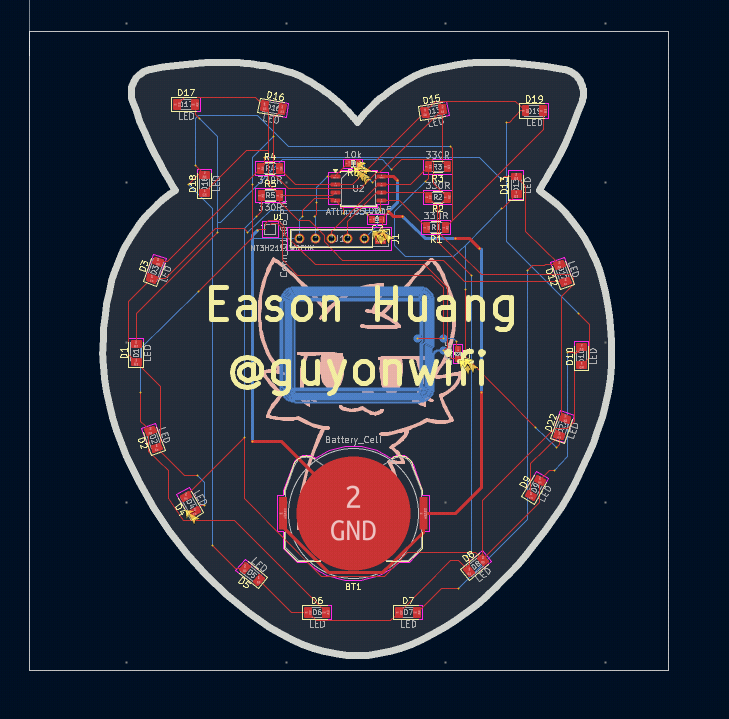
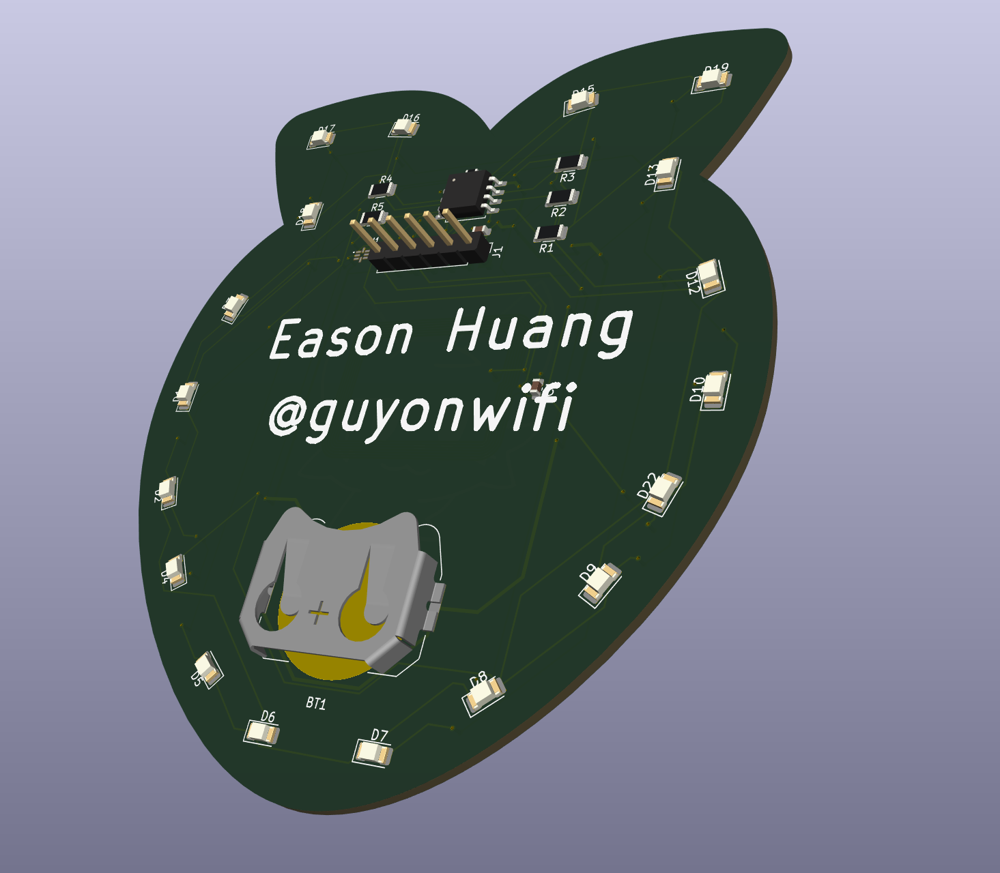
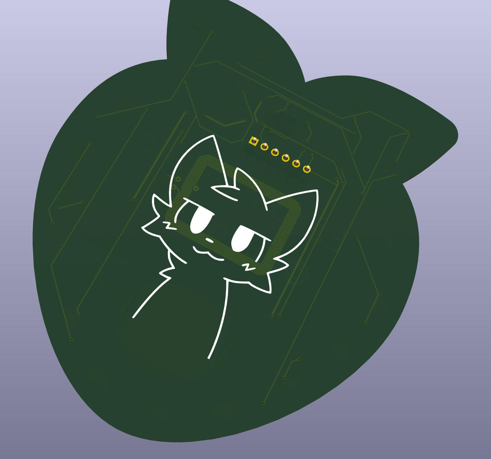
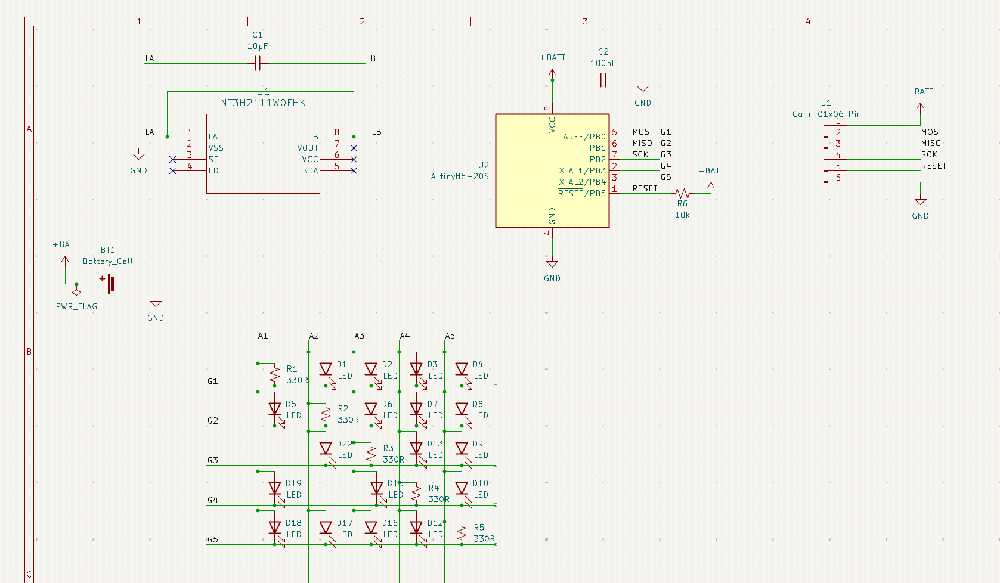

# Strawberry Badge

A little strawberry themed badge, with a microntroller to control a bunch of LEDs. Twenty LEDs controlled by 5 GPIOs, what can go wrong? 

## BOM

| Designator | Footprint | Quantity | Value | LCSC Part # |
| --- | --- | --- | --- | --- |
| BT1 | BatteryHolder_Keystone_3034_1x20mm | 1 | Battery_Cell | |
| C1 | 0603 | 1 | 10pF | |
| C2 | 0603 | 1 | 100nF | |
| D1, D2, D3, D4, D5, D6, D7, D8, D9, D10, D12, D13, D15, D16, D17, D18, D19, D22 | 1206 | 18 | LED | |
| J1 | PinHeader_1x06_P2.54mm_Vertical | 1 | Conn_01x06_Pin | |
| R1, R2, R3, R4, R5 | 1206 | 5 | 330R | |
| R6 | 0603 | 1 | 10k | |
| U1 | QFN8P50_160X160X50L40X20N | 1 | NT3H2111W0FHK | |
| U2 | SOIC-8_5.3x5.3mm_P1.27mm | 1 | ATtiny85-20S | |

##

Slack Username: `Eason Huang`

